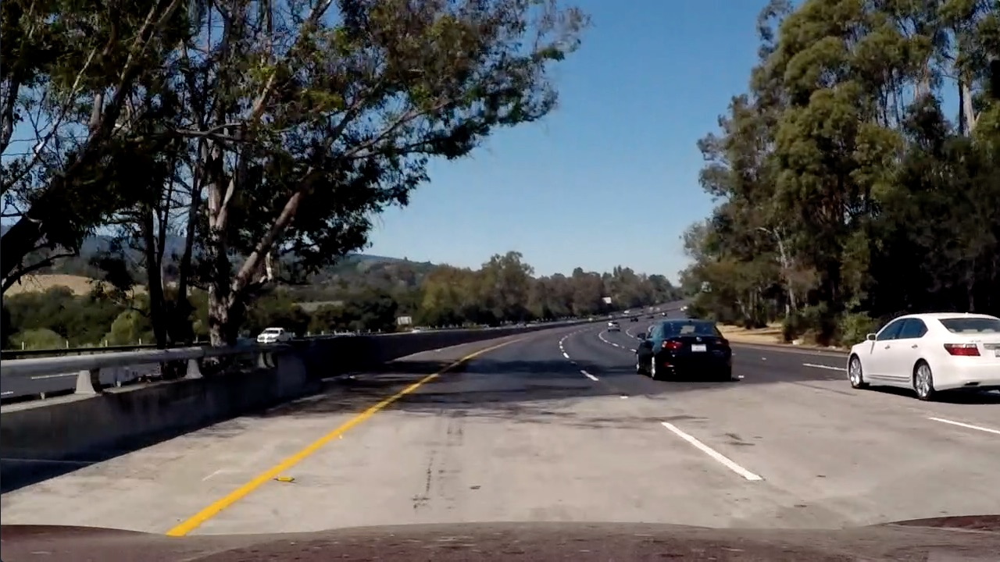
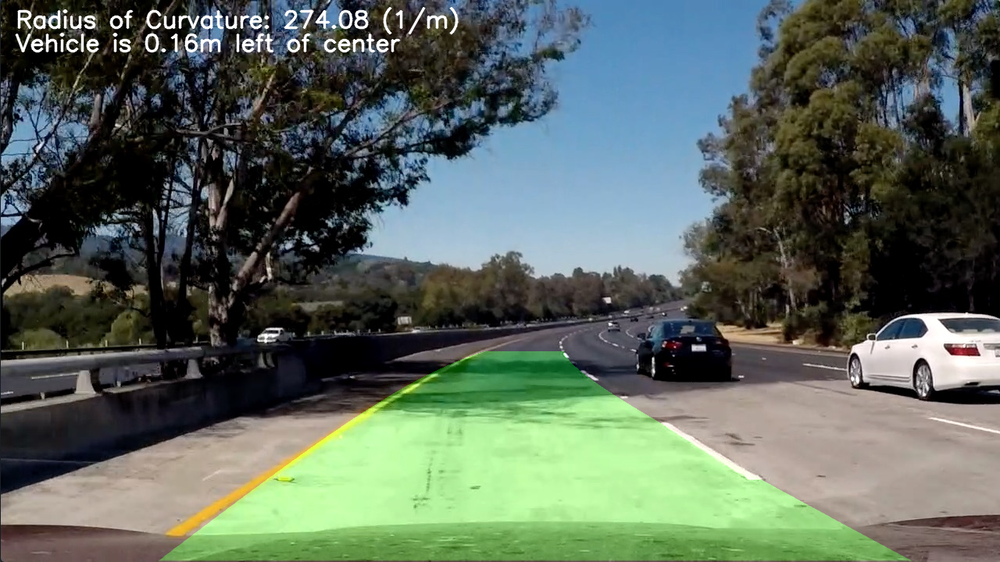
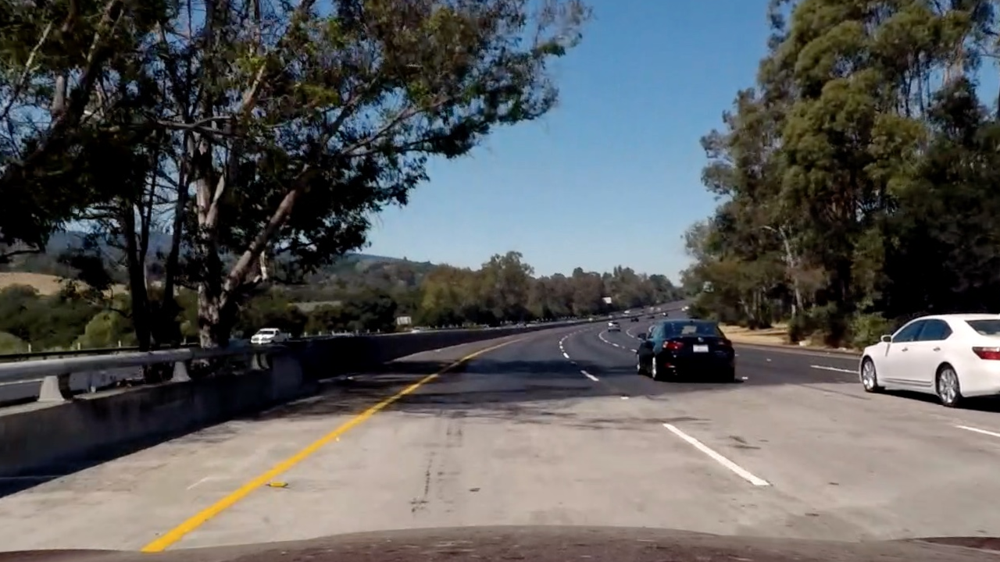
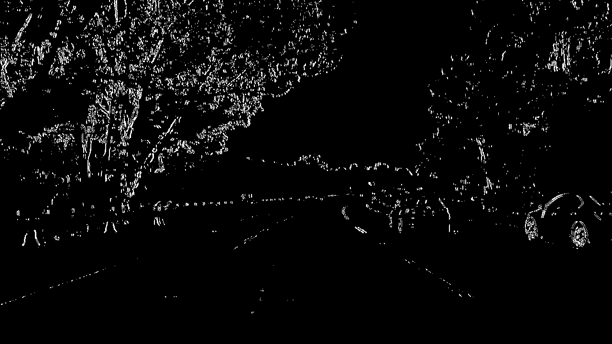
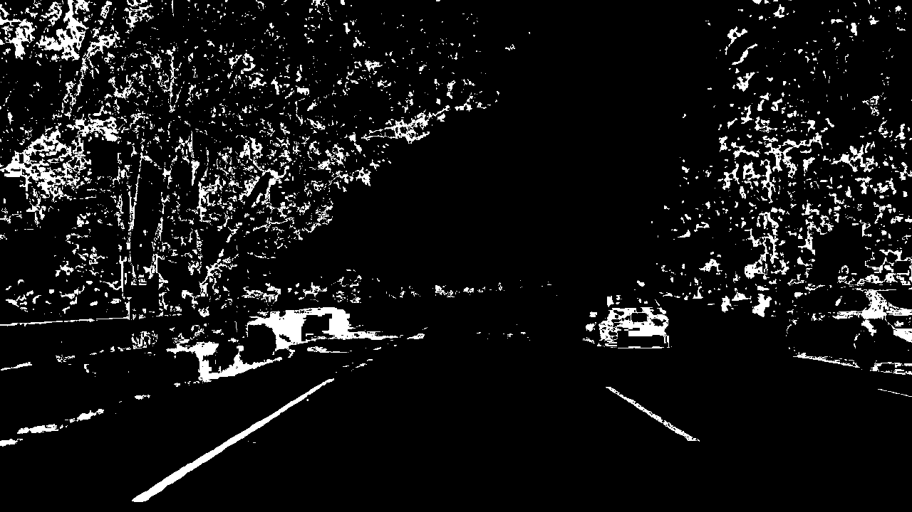
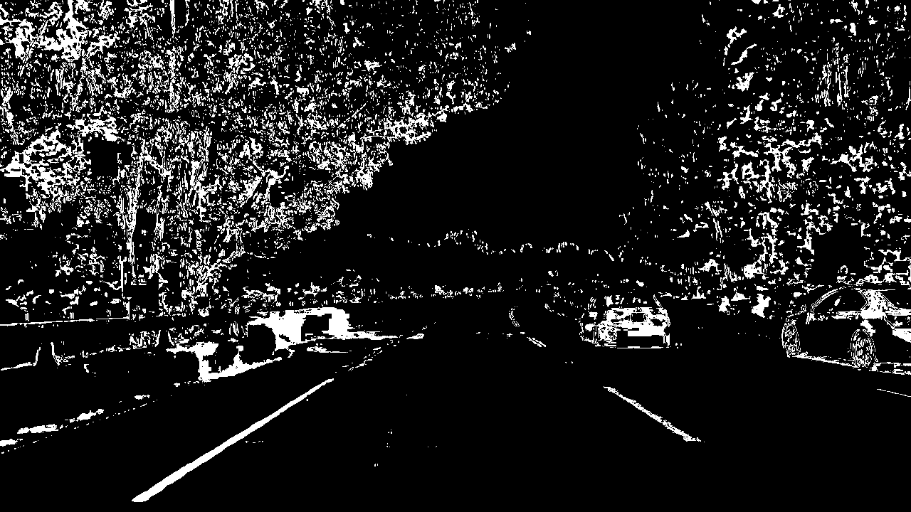
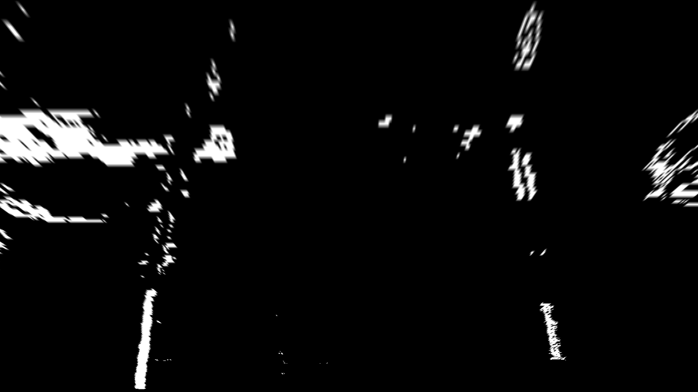
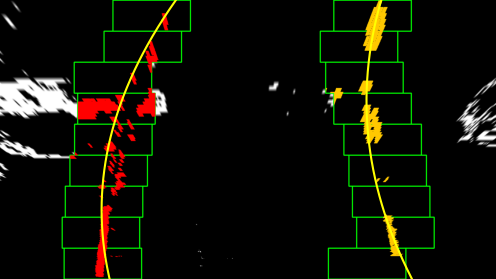
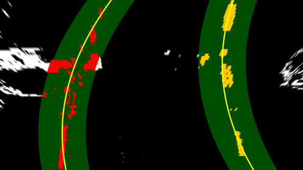
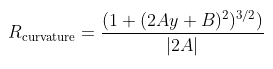

## Finding Lane Lines on the Road (Advance)

---

**Advanced Lane Finding Project**

The steps for the lane finding pipeline is:

* Compute the camera calibration matrix and distortion coefficients given a set of chessboard images.
* Apply a distortion correction to raw images.
* Use color transforms, gradients, etc., to create a thresholded binary image.
* Apply a perspective transform to rectify binary image ("birds-eye view").
* Detect lane pixels and fit to find the lane boundary.
* Determine the curvature of the lane and vehicle position with respect to center.
* Warp the detected lane boundaries back onto the original image.
* Output visual display of the lane boundaries and numerical estimation of lane curvature and vehicle position.

---
### Project Result

Raw Input Image:

Result from Pipeline:

Here's a YouTube [link to my video result](https://youtu.be/4N_BOhCKxiU)

---

### Project Code Summary
The project code is listed in the `P2.ipynb` jupyter notebook file. There are two main cell blocks:
1. Camera Calibration Cell Block: Contains code to run camera calibration based on the given chessboard images
2. Lane Finding Pipeline Cell Block: Contains code for the entire lane finding pipeline

For the lane finding pipeline, all the necessary code is encapsulated in the class `Lanes()`. The class also contains two more objects `Line()` for the left and right lane line. `Lanes()` contains all the necessary function for the project pipeline and `Line()` only contains necessary information for the individual lane lines (left or right).

To launch the pipeline, create a `Lanes()` object (which will automatically create two `Line()` object for the left and right lane lines) and launch `lane_detection_pipeline(...)` method function. This method function takes in a raw image and outputs the same raw image with curvature and offset information displayed and the lane lines indicated as shown above.

---

### Project Pipeline Description

### 1. Camera Calibration

The code for this step is contained in the first code cell of the IPython notebook located in "./examples/example.ipynb" (or in lines # through # of the file called `some_file.py`).  

The calibration is done on a set of provided chessboard images with known dimension. The code can be found in the first cell block in the `P1.ipynb` file.

The calibration is done by first creating `objpoints` that represents the chessboard corners in 3D space. Since we are treating the chessboard image as flat, the z component is simply 0. Then, the given chessboard images are loaded and the `imgpoints` for each of the chessboard image are determined using `cv2.findChessboardCorners(...)` function. With the `imgpoints` and `objpoints`, the camera is calibrated using `cv2.calibrateCamera(...)`.

Using the calculated intrinsic and distortion matrices, undistortion can be done and the following is an example of undistortion on an input chessboard image.

Undistort vs Original Image:

### 2. Distortion Correction
When reading in images, the images are first undistorted using the intrinsic and distortion matrices determined during the calibration step. The code is under the class method function `warp_binary_image(...)` in the pipeline cell.

Input Image:

Undistorted Image:

### 3. Binary Thresholding
To properly detect the lanes, the image needs to be coverted to a binary image. Thresholding is done using S-color space (from HLS) and using a first order derivative calculated across x-direction (using Sobel Operators). The hyperparameters used are listed in the code and the code under the method function `warp_binary_image(...)` in the pipeline cell. The input image used in the undistorted image.

Result: Sobel Operator Only

Result: S-Colorspace Only

Result: Binary Image (combining S-colorspace & Sobel operator)

### 4. Perspective Transform
The goal of this perspective transform is to get a "birds-eye view" of our lanes. The perspective transform is done by taking points from the image(src) and transforming it to a desired set of points(dst). The perspective matrix is calculated using the function `cv2.getPerspectiveTransform(...)`.  The actual code is under the method function `warp_binary_image(...)` in the pipeline cell.

For the source and destination coordinates, I chose to hardcode them and the resulting values are:

| Source        | Destination   | 
|:-------------:|:-------------:| 
| 570, 450      | 200, 0        | 
| 740, 450      | 1080, 0       |
| 1190, 719     | 1080, 720     |
| 100, 719      | 200, 720        |

Warped Binary Image:

### 5. Lane Line Detection
To detect the lane lines, the warped image is first turned into a histogram by summing all values along the y axis. The x point that cooresponds to the largest value is set as the baseline of the lane lines. This is done for both the left and right side from the midpoint of the image. After, a set of sliding boxes are used to determine the set of active x points. Each sliding box recalculates a mean value and the is becomes the next sliding box's midpoint. Once all x points associated with the lanes lines are selected (1 set for left and 1 set for right lane), the x points are fitted with a set of y points (manullay created that starts from top of image to the bottom) using `np.polyfit(...)` with degree 2. The actual code is listed under the method function `fit_lanes(...)` in the pipeline cell.

Fit Lanes Image:

Here, all the active x points (that were white in the warp binary image) in the sliding boxes are colored as either blue or yellow. The green boxes represents the sliding boxes. The yellow lines represents the lane lines found via the polynomial fit.

### 5.5. Lane Line Detection from Prior

Since detecting lane lines using the sliding box method is computationally expensive, to save computational cost, sequential searches are done locally in a set region than starting from scratch using sliding boxes. After the sliding box method, for the next search, a region around the previous lane lines are created. Search for active x points only occur in this marked region. The actual code is listed under the method function `fit_lanes_from_prior(...)` in the pipeline cell.

Fit Lanes using previous result:

Here, the green region is calculated by adding and subtracting a margin from the lane lines found previously. Again, the active x points are marked as either blue or orange. The yellow lines represents the lane lines found via the polynomial fit.

### 6. Smoothing
To prevent the lanes from jumping around too often, a smoothing operationg was done after a set iteration count. In the code, this iteration count was set to 5, so after 5 frames or image inputs, a smoothing operation will take place. For smoothing, the last 5 detected x points are averaged. After average, the lanes are refitted with the same y points to get fitted lines that represent the average of the past 5 frames or image inputs rather than the instantaneous lane lines. The actual code is listed under the method function `smooth_fit(...)` in the pipeline cell. 

### 7. Curvature and Offset
The overall curvature of the lane lines is calculated by averaging the curvature of the left and right lanr lines. The curvature is calculated using the equation:

where A represents the 2nd order coefficient and B represents the 1st order coefficient. y is taken as the very bottom point of the image since we want to know the curvature at the y poisition of the vehicle.

The offset represents the difference between the vehicle's midpoint position and the midpoint position of the two lanes. Both curvature and offset uses [m] as the unit of distance. 

The code for curvature and offset calculations are under the method function `vehicle_lane_info(...)` in the pipeline cell.

---

### Discussion

Majority of the difficulty came from tuning the hyperparameters so that the binary image properly shows the lane lines. Additionally, there were some trial-and-error to determine the correct prespective source and destination points for the transformation. 

Though the pipeline does work, improvements could be made to make it more robust such as:
* Remove hardcoded perspective points and detect them algorithmically.
* Improve smoothing by adding a weighted factor rather than just taking the mean.
* More tuning of the tresholds to limit only the lane lines

The pipeline could potentially fail when:
* Shadows and other materials are present covering the lane lines (water puddle, leaves, other cars, etc).
* Aggressive turns that can't easily be fitted with a 2nd degree polynomial fit.
* Lane lines that are missing or are outside of the perspective transform points. 
