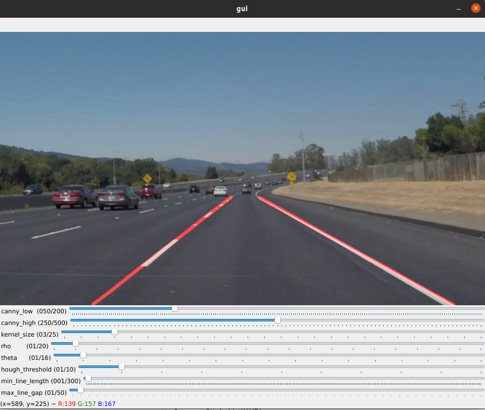

# **Finding Lane Lines on the Road** 

**Finding Lane Lines on the Road**

The goals / steps of this project are the following:
* Make a pipeline that finds lane lines on the road
* Short report on the overall process and result

---

### Reflection

### 1. My Pipeline

My pipline consisted of 6 total steps overall:

1. Converting the image to gray scale (`cv2.cvtColor`)
2. Blur the image with Gaussian Blur (`cv2.GaussianBlur`)
3. Detect edges in the image wtih Canny edge detection (`cv2.Canny`)
4. Region of interest selection using a mask (`cv2.fillPoly` & `cv2.bitwise_and`)
5. Line detection using Hough Lines (`cv2.HoughLinesP`)
6. Connect the lines using polyfit (`np.polyfit`)

All the parameter are tuned manually with the help of openCV's GUI trackbars:

In order to draw a single line on the left and right lanes, I modified the given `draw_lines()` function by:

1. Seperating the left and right line segments by comparing with the middle point
2. Use the seperated line segments to create a polyfit line for left and right lane
3. Create an inverse line to determine x starting position when y is max (at the very bottom)
4. Create 10 x points starting from x0 to the end for both the left and right lanes
5. Evaluate the polynomial to determine the associated y points for both left and right lanes
6. Plot the lines by connecting the (x,y) points along the left and right lanes, seperately

Result:

### 2. Potential Shortcomings

1. Fails to update correctly to sharp curves
2. Lane detection jumps around when the curve changes rapidly

### 3. Possible Improvements to Pipeline

1. When encoutering a sharp curve, use polyfit with different polynomial degrees. Create a scoring mechanism to determine which degree fits the best for the upcoming sharp curve. Use polyfit with degree that yields the highest score.
2. Create some sort of filter that takes the moving average rather than the instaneous result. This way, insteady of the lane detection jumping around, it will only gradually increase or decrease the overall slope.
